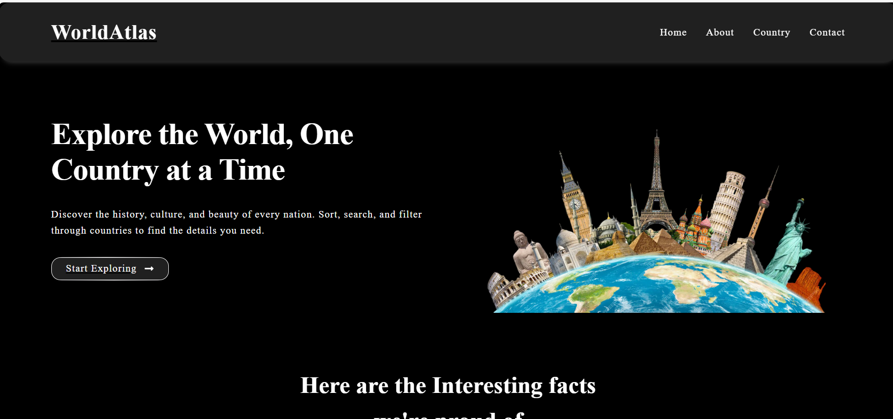
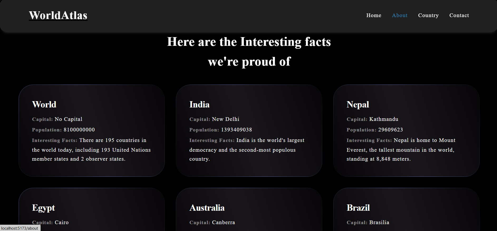
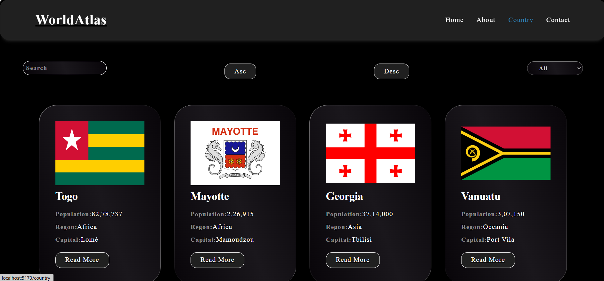
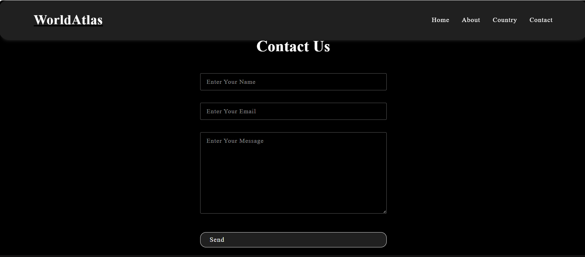

# 🌍 React Country Explorer

A React-based application to explore and learn about countries worldwide using the [REST Countries API](https://restcountries.com/).

---

## 🔥 Features

- 🌐 Fetches live country data using Axios from the REST Countries API
- 🔎 Search countries by name
- 🌍 Filter countries by region (e.g., Africa, Asia, Europe)
- 🔁 Sort countries alphabetically (ascending or descending)
- 📱 Responsive design using modern CSS
- ⚛️ Built entirely with functional React components and hooks

---

## 📦 Tech Stack

- **React JS**
- **Axios** – for API requests
- **React Router** – for routing
- **CSS/SCSS** – for styling

---

## 🚀 Getting Started

### ✅ Prerequisites

Ensure you have the following installed:

- Node.js (v14 or higher)
- npm or yarn

### 📥 Installation

```bash
git clone https://github.com/animeshojha/World-Tour.git
cd World-Tour
npm install
npm start


The app will run at: http://localhost:3000
```
📁 Project Structure

World-Tour/
│
├── public/
│   └── index.html
├── src/
│   ├── api/
│   │   └── postApi.js            # API functions using Axios
│   ├── components/
│   │   ├── Layout/
│   │   │   └── CountryCard.js
│   │   └── UI/
│   │       ├── Loader.js
│   │       └── SearchFilter.js
│   ├── pages/
│   │   └── Country.js            # Main component displaying countries
│   ├── App.js
│   └── index.js
└── package.json

### 🧠 Concepts Covered
useEffect, useState, and useTransition hooks

API data fetching using Axios and async/await

Conditional rendering (<Loader />)

Controlled components for search, sort, and filter

Array methods like filter, sort, and slice

Reusable component structure

### 📸 Screenshots






### 🙌 Author
Made with ❤️ by Animesh Ojha